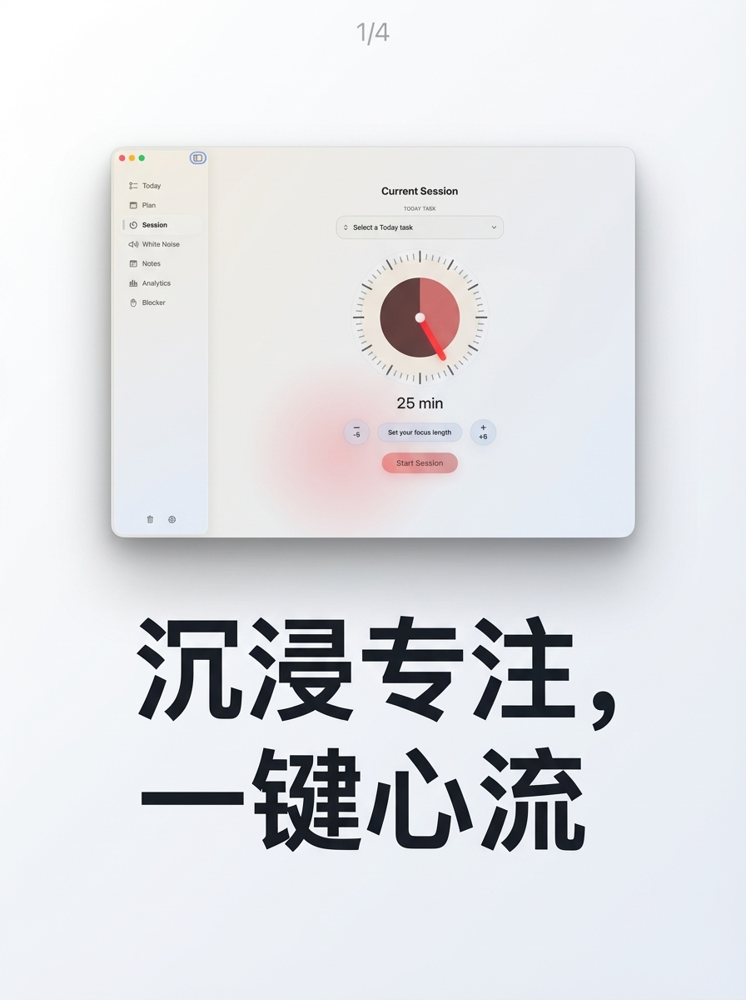
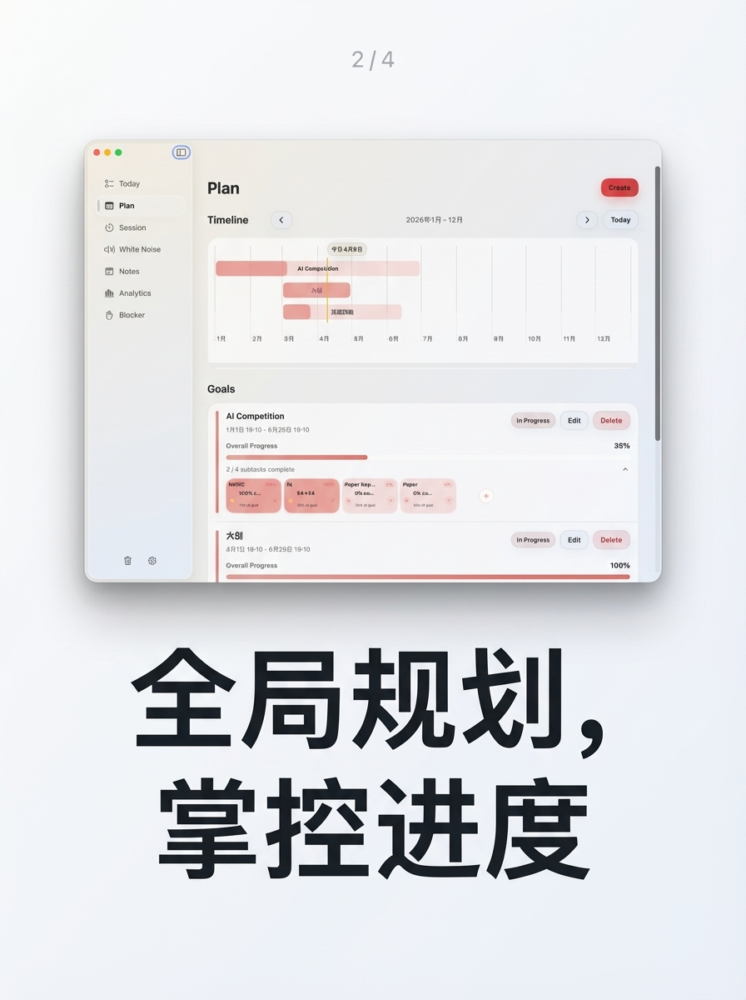
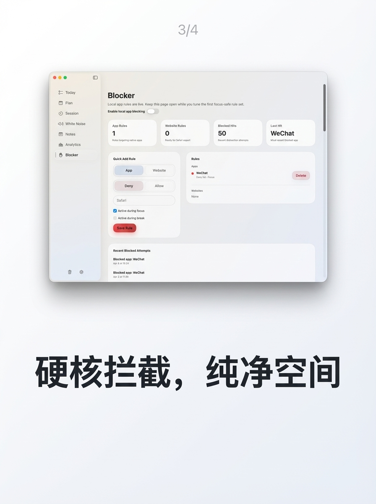
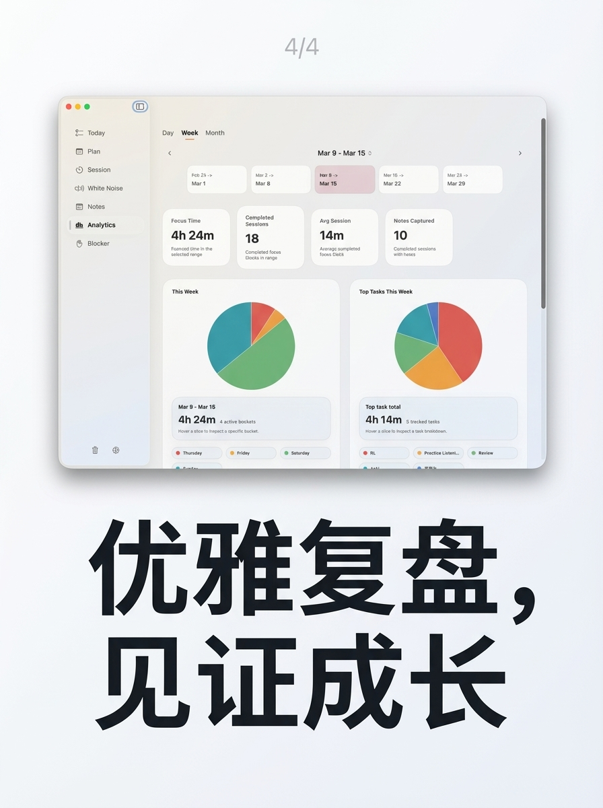

# TodayFocus

TodayFocus is a SwiftUI focus planner for macOS and iOS. It combines daily task capture, longer-horizon planning, active focus sessions, white noise, notes, analytics, distraction blocking, account surfaces, and PK focus rooms in one codebase.

## Screenshots

| Current Session | Plan |
| --- | --- |
|  |  |

| Blocker | Analytics |
| --- | --- |
|  |  |

## Highlights

- Daily task dashboard for planning and reviewing today's work
- Goal and timeline planning views for medium-term focus
- Active focus session flow with pause, finish, and reflection states
- White-noise and sound cue support for focus sessions
- Notes and analytics views for reviewing progress
- macOS blocker module for distraction control
- Account dashboard and public profile plumbing
- PK room, leaderboard, and supervision scaffolding
- `todayfocus://` deep link support for routing into the app
- Shared Swift package (`FocusSessionCore`) for domain logic and routing models

## Project Structure

- `Apps/FocusSessionApp`: macOS app target
- `Apps/FocusSessionMobileApp`: iOS app target
- `Apps/FocusSessionHelper`: macOS helper target
- `Extensions/FocusSessionSafari`: Safari extension
- `Packages/FocusSessionCore`: shared domain models, reducers, and routing
- `Tests`: app-level tests

## Build

### Requirements

- Xcode 16 or newer
- [XcodeGen](https://github.com/yonaskolb/XcodeGen)

### Generate the project

```bash
xcodegen generate
```

### Optional signing setup

By default, shared config disables signing so the project can build in local automation and CI-like environments.

If you want to run signed builds locally:

1. Copy `Config/LocalSigning.xcconfig.example` to `Config/LocalSigning.xcconfig`
2. Fill in your Apple development team ID

`Config/Shared.xcconfig` will pick it up automatically when present.

### Open in Xcode

```bash
open FocusSession.xcodeproj
```

## Tests

Package and app tests live under:

- `Packages/FocusSessionCore/Tests`
- `Tests/FocusSessionAppTests`
- `Tests/FocusSessionMobileAppTests`

You can run package tests from Xcode, or use the app test targets after generating the project.

## Current Update

This repository snapshot includes:

- Chinese UI copy and localized strings
- account navigation and profile surfaces
- PK room, leaderboard, and supervision scaffolding
- CloudKit repository models for PK and supervision data
- project config updates for optional local signing
